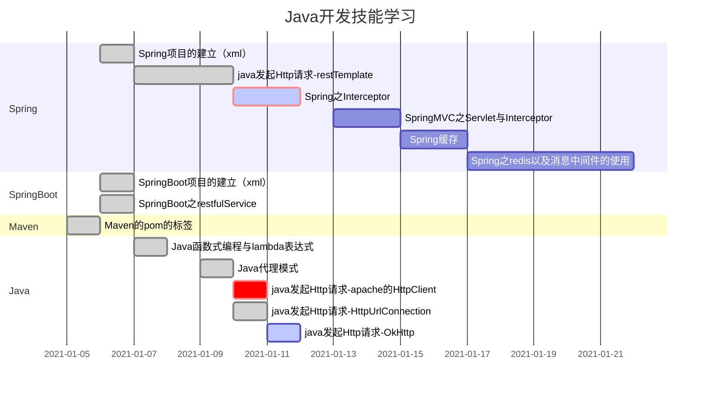

# Java开发技能需求（待掌握技能）

参考：BOSS直聘招聘需求

常用Java中间件

dubbo，分布式缓存，消息队列

redis，kafka，zookeeper，etcd

大数据：Hadoop，spark，flink

Spring，SpringBoot，SpringCloud

分布式数据库：DRDS，oceanBase，ShardingSphere

docker，CI，CD工具

maven，gradle

Java多线程、缓存、安全

HTTP、Rest相关概念

VUE，REAT

# Java生态圈技术框架、中间件、系统架构汇总

参考：[Java生态圈技术框架、中间件、系统架构汇总](https://juejin.cn/post/6844903620979212296)

# Java开发技能学习

